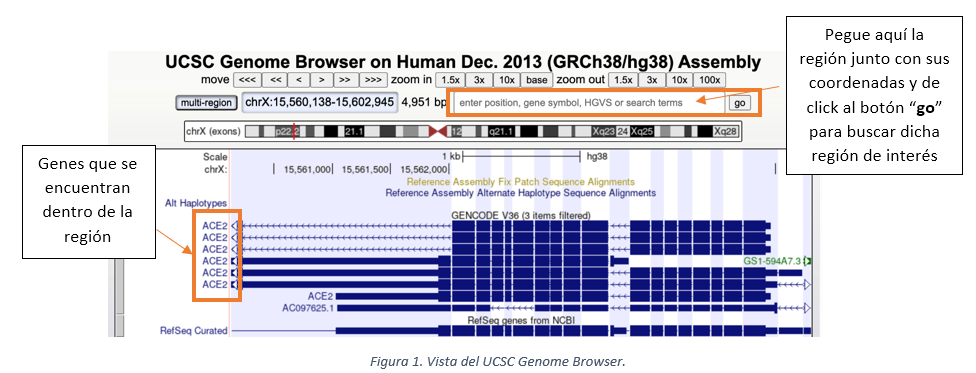

# <p align='justify'><span style = 'color: darkorange'><strong>Nombre y Apellido: Juan Carlos García Estupiñán</strong></span></p>

## <p align='justify'><span style = 'color: darkorange'>Actividad 1.- Manipulación y formateo de archivos: Formato BED</span></p>

### <p align='justify'><span style = 'color: darkorange'><strong>Objetivo:</strong></span></p>

<p align='justify'>El objetivo de esta actividad es que el estudiante aprenda a manipular y formatear archivos empleando diferentes comandos de Linux aprendidos a lo largo de las sesiones. Específicamente, se trabajará con el formato BED (Browser Extensible Data) que se utiliza ampliamente en bioinformática para almacenar regiones genómicas como coordenadas y anotaciones asociadas. Este formato se caracteriza por presentar los datos en forma de columnas separadas por espacios o tabuladores.</p> 

### <p align='justify'><span style = 'color: darkorange'><strong>Detalles sobre la entrega</strong></span></p> 

* <p align='justify'> La entrega se realizará utilizando este documento como plantilla; adicionando el código y las capturas de pantalla asociados en los espacios determinados a ese uso (puede incrementar o reducir el tamaño de los mismos). Recordar que las actividades a realizar están resaltadas en negrita.

* <p align='justify'>Será esencial adicionar en las capturas de pantalla su usuario (adicionar el promp completo) e intentar que la resolución de las mismas sea el máximo posible.</p> 

* <p align='justify'>La entrega se realizará a través del Campus VIU en un archivo único en formato PDF.</p> 

### <p align='justify'><span style = 'color: darkorange'><strong>Parte I: Obtención de los datos.</strong></span></p> 

<p align='justify'>Los datos con los cuales va a trabajar hacen referencia a una serie de regiones de interés detectadas en un tipo de células inmunitarias, las células B, en humanos. Para ello, se han realizado dos réplicas del experimento, obteniendo dos archivos llamados human_coordinates_1.bed y human_coordinates_2.bed. Estos dos archivos están disponibles en la propia actividad propuesta en el campus virtual:</p> 

* <p align='justify'>Actividades/Portafolio de pruebas aplicativas/Prueba aplicativa 1/human_coordinates_1.bed</p> 

* <p align='justify'>Actividades/Portafolio de pruebas aplicativas/Prueba aplicativa 1/human_coordinates_2.bed</p> 

<p align='justify'>Entorno de rabajo (pipeline)</p> 

Trabajaré principalmente en Shellscripting de este repositorio

```
[UNIVERSIDADVIU\juan.carlos@a-3uv58hx3etnvo VIU]$ tree
.
├── LICENSE
├── README.md
└── ShellScripting
    ├── README.md
    ├── actividad1.md
    ├── actividad1.pdf
    ├── code
    │   ├── actividad1.sh
    │   └── funciones_act1.sh
    ├── data
    │   ├── processed
    │   │   ├── hc1_ord.bed
    │   │   └── hc2_ord.bed
    │   └── raw
    │       ├── human_coordinates_1.bed
    │       └── human_coordinates_2.bed
    ├── graficas_imagenes
    │   └── captura_actividad1.png
    └── sesiones
        └── sesion2
            └── sesion2.sh

8 directories, 13 files
```
<p align='justify'><strong>Acceda a la ruta anterior y descárguese los datos en su entorno de trabajo. Visualice las 5 primeras líneas de cada uno de los archivos. Incluya el código empleado para realizarlo junto a una captura de pantalla (0,5 pts)</strong></p> 

STDIN  

```
#!/usr/bin/env bash

# IMPORTANTE!!! Antes que nada obtenemos las funciones creadas en 
# el otro script llamado funciones_act1.sh, nos serán útiles.
source funciones_act1.sh

###### Parte I de la actividad 
# Empezaremos con un vistazo de las 5 primeras líneas de cada 
# uno de los archivos

echo ">>> 5 Primeras líneas de human_coordinates_1.bed"

head -n 5 ../data/raw/human_coordinates_1.bed

echo ">>> 5 Primeras líneas de human_coordinates_2.bed"

head -n 5 ../data/raw/human_coordinates_2.bed

echo "FIN DE ESTA PARTE-------------------------------------------------------"
```

STDOUT

```
[UNIVERSIDADVIU\juan.carlos@a-3uv58hx3etnvo code]$ ./actividad1.sh
>>> 5 Primeras líneas de human_coordinates_1.bed
chr3    62722434        62722633
chr3    62796034        62796233
chr3    62796234        62796433
chr3    62796434        62796633
chr3    62815834        62816033
>>> 5 Primeras líneas de human_coordinates_2.bed
chr3    62722434        62722633
chr3    62796034        62796233
chr3    62796234        62796433
chr3    62796434        62796633
chr3    62815834        62816033
FIN DE ESTA PARTE-------------------------------------------------------
```

<p align='justify'>Seguidamente, responda a cada una de las preguntas que se le indican, adicionando siempre una captura de pantalla con los comandos empleados y la respuesta obtenida por la salida estándar.</p> 

<p align='justify'><strong><em>los comandos se encuentran en el script: code/actividad1.sh</strong></em></p>

* <p align='justify'><strong>¿Cuántas líneas presenta cada uno de los archivos descargados? (0,5 pts)</strong></p>

### STDIN

```
# Seguimos con las líneas de cada uno de los archivos
echo ">>> Número de líneas de human_coordinates_1.bed"

wc -l ../data/raw/human_coordinates_1.bed

echo ">>> Número de líneas de human_coordinates_2.bed"

wc -l ../data/raw/human_coordinates_2.bed

echo "FIN DE ESTA PARTE-------------------------------------------------------"
```

STDOUT

```
[UNIVERSIDADVIU\juan.carlos@a-3uv58hx3etnvo code]$ ./actividad1.sh 
>>> Número de líneas de human_coordinates_1.bed
1907 ../data/raw/human_coordinates_1.bed
>>> Número de líneas de human_coordinates_2.bed
1909 ../data/raw/human_coordinates_2.bed
FIN DE ESTA PARTE-------------------------------------------------------
```

* <p align='justify'><strong>¿Cuántas columnas presenta cada uno de los archivos descargados? (1 pts)</strong></p>

### STDIN funciones_act1.sh (comando ```**source**``` para interconectar scripts)

```
#!/usr/bin/env bash

# Funciones que me han parecido oportunas para tener

# Función para contar el nº de columnas
function ncol(){
    echo "Nº de columnas de $1"
    awk -F'\t' '{print NF}' $2 | uniq
}
```

STDIN actividad1.sh

```
# Nº de columnas de cada archivo
ncol human_coordinates_1 ../data/raw/human_coordinates_1.bed
ncol human_coordinates_2 ../data/raw/human_coordinates_2.bed

echo "FIN DE ESTA PARTE-------------------------------------------------------"
```

STDOUT

```
[UNIVERSIDADVIU\juan.carlos@a-3uv58hx3etnvo code]$ ./actividad1.sh 
>>> Número de columnas de human_coordinates_1.bed
3
>>> Número de columnas de human_coordinates_2.bed
3
FIN DE ESTA PARTE-------------------------------------------------------
```

* <p align='justify'><strong>¿Tenemos representación de todos los cromosomas humanos en ambos archivos? (1 pts)</strong></p>

### STDIN funciones_act1.sh (comando ```**source**``` resto del script)

```
# Función para estudiar los los cromosomas 
function ver_chr(){
    echo ">>> ¿Están todos los cromosomas en $1?"
    echo ">> Cormosomas del archivo $1"
    cut -f1 $2 | sort -k1.4 -n | uniq
    echo ">> Nº de líneas de $1, si es < a 23, faltan Chr"
    cut -f1 $2 | sort -k1.4 -n | uniq | wc -l
}
```

```
# ¿Hay representación de todos los cromosonas humanos en ambos los archivos?.  

ver_chr human_coordinates_1 ../data/raw/human_coordinates_1.bed
ver_chr human_coordinates_2 ../data/raw/human_coordinates_2.bed

echo "FIN DE ESTA PARTE-------------------------------------------------------"
```

STDOUT
```
[UNIVERSIDADVIU\juan.carlos@a-3uv58hx3etnvo code]$ ./actividad1.sh 
>>> Están todos los cromosomas en human_coordinates_1
>> Cormosomas del archivo
chr1
chr2
chr3
chr4
chr5
chr6
chr7
chr8
chr9
chr10
chr11
chr12
chr13
chr14
chr15
chr16
chr17
chr18
chr20
chr21
chr22
>> Nº de líneas de lo anterior, si es < a 23, no están todos los cormosomas
21
>>> Están todos los cromosomas en human_coordinates_2
>> Cormosomas del archivo
chr1
chr2
chr3
chr4
chr5
chr6
chr7
chr8
chr9
chr10
chr11
chr12
chr13
chr14
chr15
chr16
chr17
chr18
chr20
chr21
chr22
>> Nº de líneas de lo anterior, si es < a 23, no están todos los cormosomas
21
FIN DE ESTA PARTE-------------------------------------------------------
```

<p align='justify'>Al ser réplicas experimentales esperaríamos que ambos archivos fueran idénticos. <strong>Para comprobarlo, primero ordene los dos archivos por el nombre del cromosoma (determinado en la primera columna). Seguidamente, compárelos para mostrar qué regiones son distintas entre ambos. Adjunte una captura de pantalla con los comandos empleados que muestren cuántas y qué regiones son distintas entre ambos archivos (2 pts)</strong></p>

### STDIN

```
# Ahora vamos a ver si los datos difieren.
# OJO, vamos a crear dos nuevos archivos que son los datos procesados 
# ordenados de mayor a menor. Para que se vea bien en la memoria los
# llamaremos: 
# human_coordinates_1.bed -> hc1_ord.bed 
# human_coordinates_2.bed -> hc2_ord.bed 
echo ">>> Ordenamos ambos datos y guardamos los resultados en un nuevo archivo"

sort -k 1.4 -n ../data/raw/human_coordinates_1.bed > ../data/processed/hc1_ord.bed 

sort -k 1.4 -n ../data/raw/human_coordinates_2.bed > ../data/processed/hc2_ord.bed 

echo ">> En caso de diferencias ¿Cuántas y que regiones son diferentes?"
# Primero preguntamos me gusta la idea de pregunta si difieren
echo "> ¿Difieren?"
diff ../data/processed/hc1_ord.bed ../data/processed/hc2_ord.bed -q
# Lo siguiente ya es ver cuáles presentan en ese caso diferencias
echo "> ¿Dónde?"
diff ../data/processed/hc1_ord.bed ../data/processed/hc2_ord.bed 

echo "FIN DE ESTA PARTE-------------------------------------------------------"  
```

### STDOUT

```
[UNIVERSIDADVIU\juan.carlos@a-3uv58hx3etnvo code]$ ./actividad1.sh 
>>> Ordenamos ambos datos y guardamos los resultados en un nuevo archivo
>> En caso de diferencias ¿Cuántas y que regiones son diferentes?
> ¿Difieren?
Files ../data/processed/hc1_ord.bed and ../data/processed/hc2_ord.bed differ
> ¿Dónde?
232a233
> chr1  204073115       204127743
671a673
> chr6  31164337        31170682
1654a1657
> chr17 42313412        42388540
FIN DE ESTA PARTE-------------------------------------------------------
```

<p align='justify'><strong>Una vez identificadas estas regiones, las debe seleccionar y guardarlas en un archivo nuevo. Ojo solo tiene que guardar las tres columnas, cromosoma, coordenada de inicio y coordenada de fin de cada una de las regiones detectadas. Visualice las primeras líneas de este archivo creado. Incluya una captura de pantalla que muestre el código empleado (1 pts)</strong></p>

<p align='justify'>Ahora va a transformar el formato de estas coordenadas genómicas almacenadas. Para ello, debe sustituir el primer tabulador por dos puntos y el segundo por un guion; de forma que las coordenadas presenten la siguiente estructura: chr:inicio-fin. Fíjese en el ejemplo:</p>

* Formato inicial: chr6	20978845	20979044
* Formato final: chr6:20978845-20979044

<p align='justify'>Una vez que tenga las regiones seleccionadas con el formato correcto, las deberá caracterizar e identificar para conocer qué genes alberga en su interior. Para ello, deberá acceder al siguiente <a href="https://genome.ucsc">navegador genómico alojado por la Universidad de California, Santa Cruz</a>.edu/. Una vez allí, se situará en el menú denominado “<strong>Genomes”</strong> (parte superior derecha) y seleccionará el assembly actual y de referencia del genoma del ser humano denominado Human GRCh38/hg38</p>

<p align='justify'><strong>¿A qué nos referimos cuando hablamos del Human Genome Assembly?. (0,5 pts)</strong></p>

<p align='justify'>Al dar click en él, se abrirá un sitio web interactivo donde podrá pegar cada una de las regiones detectadas para identificar qué genes se encuentran en dichas coordenadas genómicas. <strong>Adjunte una captura de pantalla (como la que se muestra a continuación) para cada una de las regiones encontradas previamente donde se visualice la región y el o los genes que se encuentran en ella (1 pts)</strong></p>

---



---

<p align='justify'><strong>Finalmente, cree un archivo final, donde incluya en la primera columna las regiones identificadas previamente con el formato, cromosoma:inicio-fin y una segunda columna con el nombre del gen que ha detectado en cada una de ellas. Visualice las primeras líneas del archivo creado. Incluya una captura de pantalla con el código empleado (1pts).</strong></p>
